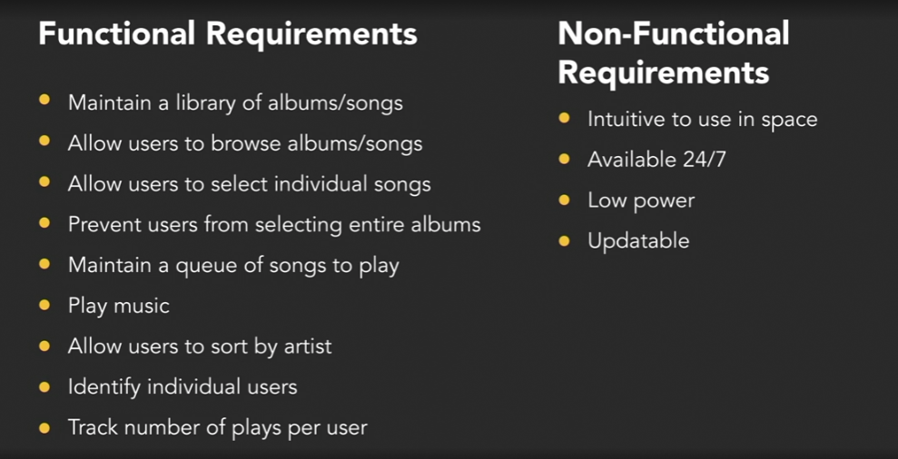
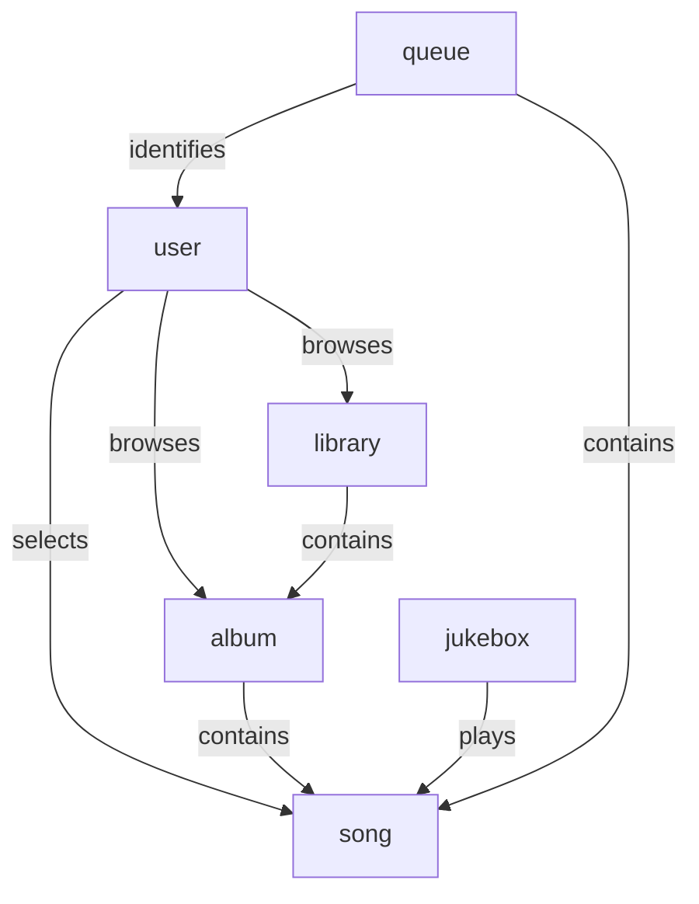

# Programming Foundations: Object-Oriented Design

[Programming Foundations: Object-Oriented Design](https://www.linkedin.com/learning/programming-foundations-object-oriented-design-3/objects?autoSkip=true&resume=false)

## Object-Oriented Fundamentals

- object-oriented
  - analysis: understand the problem
  - design: plan your solution
  - programming: build your solution
- Procedural vs OOP
- all objects have:
  - identify: e.g. Olivia's coffee mug
  - attributes: color, size, fullness
    - can also be called: properties, characteristics, state, fields, variables
  - behaviors: fill(), empty(), clean()
    - can also be called: methods
- objects = nouns (things, people, places, ideas, concepts), you can put the word "the" in front of it
- behaviors = verbs
- classes to create objects
- class: code-template for creating program objects
  - class components:
    - name (or type)
    - attributes (or properties)
    - behaviors (or operations)
      - Method: a program procedure defined as part of a class that can return a value
- 4 fundamental ideas when creating classes (APIE)
  - Abstraction (focus on essential qualities of something)
  - Polymorphism ()
    - dynamic polymorphism: uses the same interface for methods on different types of objects
      - method overriding: inherit a method and override it
    - static polymorphism: method overload, e.g. vtk GetPoint()
      - method overloading: implements multiple methods with the same name but different parameters
  - Inheritance (base a new object or class (subclass) on an existing one (superclass) to inherit existing attributes and methods)
    - code reuse
  - Encapsulation (restricting access - an object should not make anything about itself, e.g. hide attribute and only accessible with methods) [Black Boxing]
    - to reduce dependencies

## Requirements

- analysis and design approach
  1. gather requirements
  1. describe the app
  1. identify main objects
  1. describe the interactions
  1. create class diagram
- Unified Modeling Language (UML): standardized notation for diagrams to visualize object-oriented systems
- class diagram

    | Name       |
    | ---------- |
    | Attributes |
    | Behaviors  |

- use case diagram
- functional requirements: what must it do?
  - the system/app must do ...
- non-functional requirements: how should it do it? (legal, performance, support, security)
  - the system/app should be ...
- FURPS+ requirements
  - Functionality: capability, reusability, security
  - Usability: human factors, aesthetics, consistency, documentation
  - Reliability: availability, failure rate & duration, predictability
  - Performance: speed, efficiency, resource consumption, scalability
  - Supportability: testability, extensibility, serviceability, configurability
  - +: design, implementation, interface, physical

## Uses Cases and User Stories

- uses cases 3 essential things:
  - title(what is the goal?)
  - primary actor (who desires it?)
  - success scenario (how is it accomplished?)
  - optional: extensions, pre-conditions, post-conditions, secondary actors, stakeholders, scope, priority, owner
- use cases prompts:
  - Who performs system administration tasks?
  - Who manages users and security?
  - What happens if the system fails?
  - is anyone looking at performance metrics or logs?
- user story:
  - As a (type of user)
  - I want (goal)
  - do that (reason)

| user stories | use cases |
| -------- | -------- |
| short (one index card)   | long (a document)          |
| one goal, no details   | multiple goals and details         |
| informal   | casual to (very) formal        |
| "Placeholder for conversation"   | "Record of conversation"   |

### challenge

goal: write 2 use cases and 2 user stories

use cases:

1. Play a song

- Actor: astronaut
- Scenario:
    1. System identifies user.
    1. Astronaut browses albums.
    1. Astronaut selects an album and browses songs fo the album.
    1. Astronaut selects individual song.
    1. Jukebox plays the selected song.

1. Select the next song

- Actor: astronaut
- Scenario:
    1. Astronaut selects a song while another song is playing.
    1. Selected song is added to a queue.
    1. When the song is first in the queue, jukebox plays the song.

user stories:

1. As an astronaut, I want to listen to music so that I can relax.
1. As an astronaut, I want to be able to sort the albums by artist so that I don't need to know all the album titles.

## Domain Modeling

- moving from analysis to design phase
- conceptual model: represents important objects and the relationships between them
- to identify objects: list the nouns from the use cases
  - draw lines between them for their relationships and add verbs on the lines
- to identify responsibilities: list the verbs from the use cases
- avoid god objects
- Class Responsibility Collaboration (CRC) cards

### challenge

## Class Diagrams

- best focus while creating classes: what does this class do? what's its role? > need to avoid seeing classes as data only, classes with no method is a red flag
- camelCase
- encapsulation: private (-) vs public (+)
- static attributes and static methods
- constructors and multiple constructions (polymorphism: overload, overriding)

## Inheritance and Composition

- Inheritance: describes an "is a" relationship ("is a kind of", "is a type of")
- abstract class:
  - exists for other classes to inherit
  - cannot be instantiated
  - contains at least one abstract method
- java has "final" class which is referred as a "concrete" class (the opposite of abstract); other classes cannot inherit from it
- Interface: list of methods for a class to implement. It doesn't contain any actual behavior
  - in class diagram, represented by a box similar to a class but with the tag <<interface>> and dashed arrows from classes using it
- interface vs abstract class
  - interfaces represent a capability; can be implement for different classes
  - abstract class represent a type
- aggregation: one object is built of other objects
  - "has a" relationship, "uses a" or "uses many"
  - in class diagram, represented by an unfilled diamond
- composition: more specific form of aggregation which implies ownership
  - in class diagram, represented by a filled diamond
